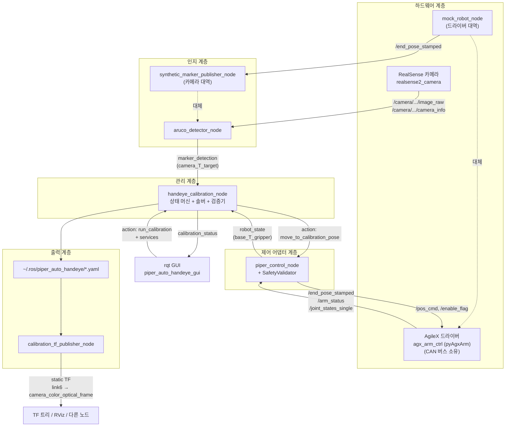
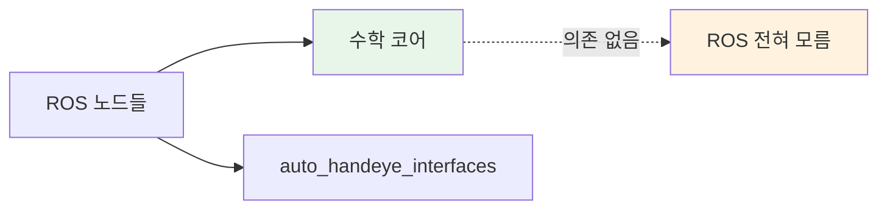
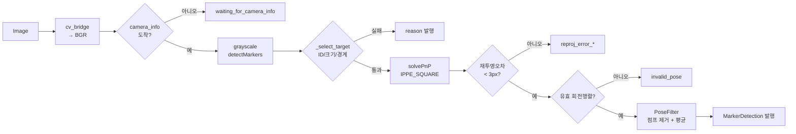
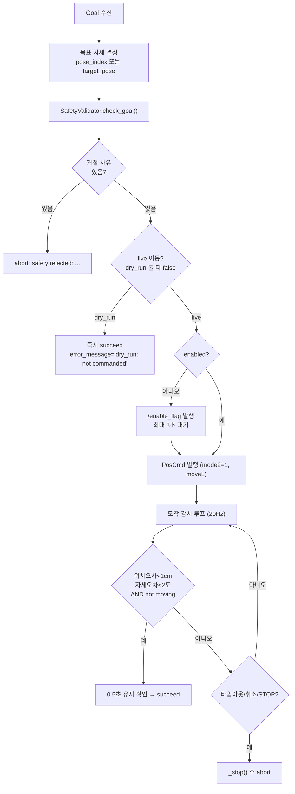
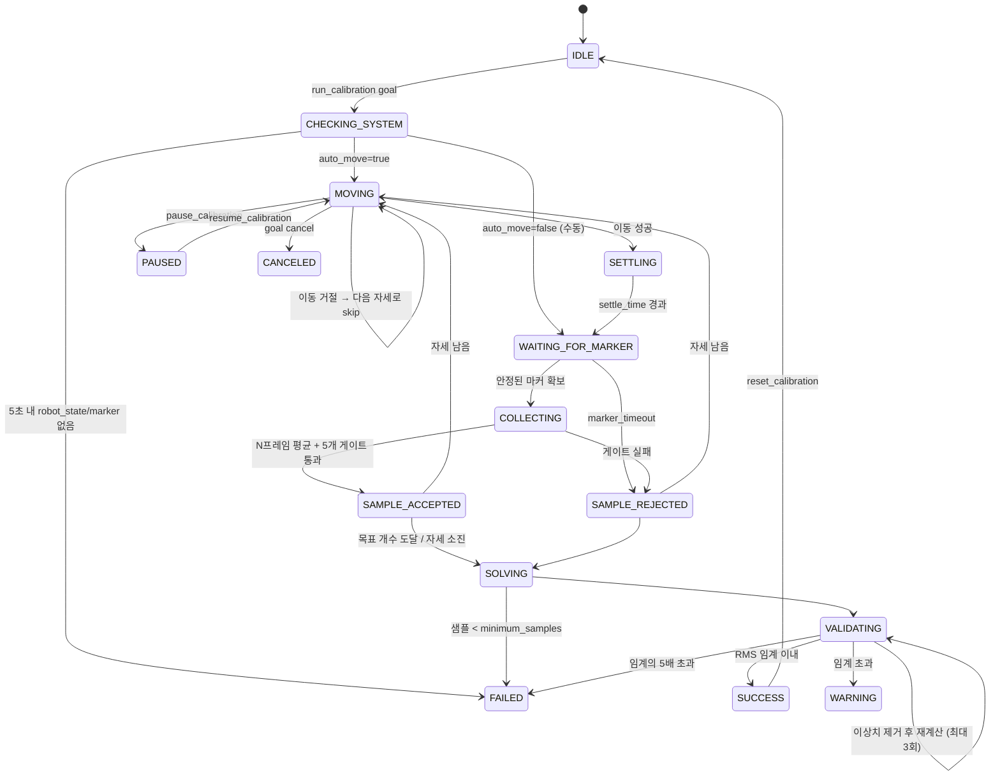
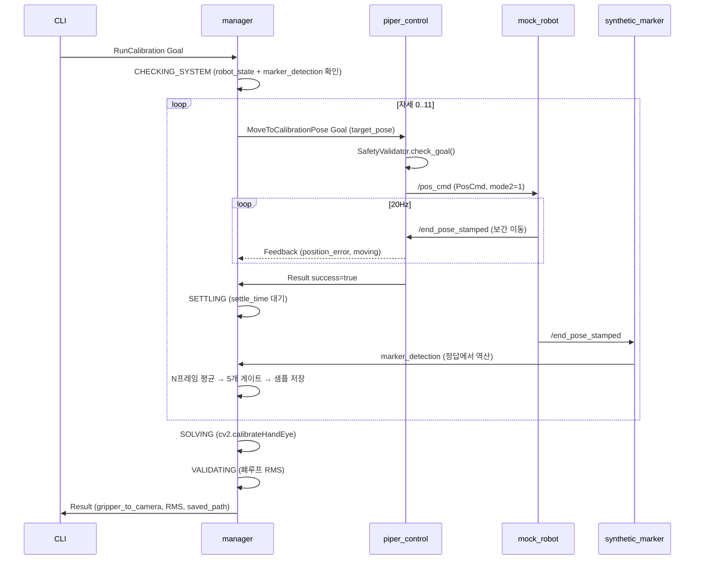
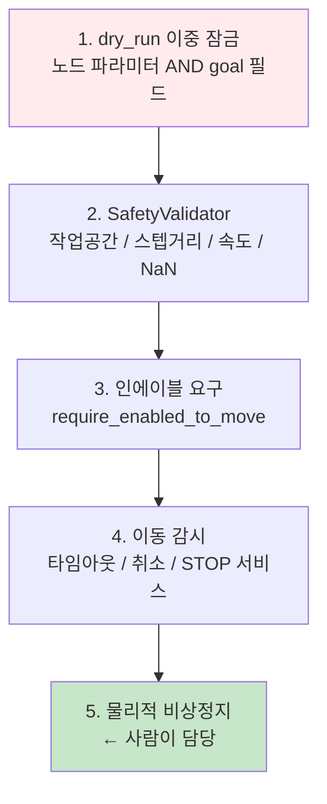

# autoCali 전체 구조 해설 (Hand-Eye Calibration)

이 문서는 `autoCali` 워크스페이스의 **Eye-in-Hand 자동 hand-eye 캘리브레이션**
시스템을 노드 구조부터 실제 API 호출까지 순서대로 설명합니다.

- 대상 로봇: AgileX Piper (6축)
- 카메라: Intel RealSense (엔드이펙터 `link6`에 고정)
- 타겟: 작업공간에 고정된 단일 ArUco 마커
- 최종 결과물: `gripper_T_camera` (= `link6 → camera_color_optical_frame` 정적 TF)

---

## 목차

1. [한 장으로 보는 전체 구조](#1-한-장으로-보는-전체-구조)
2. [문제 정의: hand-eye가 푸는 방정식](#2-문제-정의-hand-eye가-푸는-방정식)
3. [패키지 & 파일 지도](#3-패키지--파일-지도)
4. [ROS 인터페이스 전체 목록](#4-ros-인터페이스-전체-목록)
5. [노드별 상세 해설](#5-노드별-상세-해설)
6. [상태 머신 완전 해부](#6-상태-머신-완전-해부)
7. [수학 코어 API 레퍼런스](#7-수학-코어-api-레퍼런스)
8. [실행 시나리오별 호출 시퀀스](#8-실행-시나리오별-호출-시퀀스)
9. [설정 파일 레퍼런스](#9-설정-파일-레퍼런스)
10. [안전(Safety) 계층](#10-안전safety-계층)
11. [현재 코드 상태에서 주의할 점](#11-현재-코드-상태에서-주의할-점)

---

## 1. 한 장으로 보는 전체 구조



### 계층 설계의 핵심 아이디어

| 계층 | 역할 | 왜 분리했나 |
|---|---|---|
| 인지 | 이미지 → `camera_T_target` | 검출 알고리즘(ArUco→ChArUco)을 교체해도 상위는 그대로 |
| 제어 어댑터 | 기존 드라이버 위에 **안전 검증 + 표준 상태 스트림** | 실기/mock을 **같은 코드**로 구동 |
| 관리 | 상태 머신, 언제 샘플을 딸지 결정 | 로봇·카메라 종류와 무관한 순수 절차 |
| 수학 코어 | ROS 없이 numpy만 | 하드웨어 없이 단위 테스트 가능 |

> **가장 중요한 설계 결정**: `piper_control_node`는 SDK를 다시 감싸지 않습니다.
> CAN 버스는 벤더 드라이버 `agx_arm_ctrl`이 소유하고, 컨트롤 노드는 그 **ROS
> 인터페이스에만** 말을 겁니다. 그래서 `mock_robot_node`나 Gazebo 드라이버가
> 같은 인터페이스를 흉내내기만 하면 전체 스택이 하드웨어 없이 그대로 돌아갑니다.
>
> 실기는 `control_backend: agx`(`control/move_p`, `feedback/tcp_pose`),
> 시뮬레이션은 `control_backend: topic`(구버전 `/pos_cmd`)을 씁니다. 두 백엔드는
> 같은 내부 상태 머신에 데이터를 넣으므로 그 위 계층은 전부 동일한 코드입니다.

---

## 2. 문제 정의: hand-eye가 푸는 방정식

### 2.1 이름 규칙

```
A_T_B  =  "A 좌표계에서 표현한 B"  =  B의 점을 A로 옮기는 변환
p_A = A_T_B @ p_B
```

이 규칙 하나만 지키면 프레임 방향 실수를 거의 다 막을 수 있습니다.
(hand-eye 실패 원인 1위가 방향 뒤집힘입니다.)

| 기호 | 뜻 | 출처 |
|---|---|---|
| `base_T_gripper` | 로봇 베이스에서 본 플랜지(link6) | `/end_pose_stamped` |
| `camera_T_target` | 카메라 광학계에서 본 마커 | ArUco 검출 |
| `gripper_T_camera` | **구하려는 값** — 플랜지에서 본 카메라 | 솔버 출력 |
| `base_T_target` | 베이스에서 본 마커 | 검증용 계산값 |

### 2.2 왜 풀 수 있는가

마커는 **움직이지 않고**, 카메라는 **플랜지에 붙어 있습니다**. 따라서 모든
샘플 `i`에 대해:

```
base_T_target = base_T_gripper_i @ gripper_T_camera @ camera_T_target_i
              └───────────────── 좌변은 i와 무관하게 항상 같은 값 ─────────────┘
```

두 샘플 `i, j`를 빼면 미지수 `X = gripper_T_camera`에 대한 고전적인
**`A·X = X·B`** 형태가 나옵니다:

```
A = base_T_gripper_i⁻¹ @ base_T_gripper_j     (로봇의 상대 운동)
B = camera_T_target_i @ camera_T_target_j⁻¹   (카메라가 본 상대 운동)
```

이 방정식을 푸는 알고리즘이 TSAI, PARK, HORAUD, ANDREFF, DANIILIDIS이고,
OpenCV `calibrateHandEye()`가 전부 구현하고 있습니다.

### 2.3 왜 자세가 여러 개, 그리고 "회전 축 2개 이상"이 필요한가

`A·X = X·B`에서 회전축이 한 방향뿐이면 그 축 방향 성분이 **결정되지 않습니다**
(해가 무한히 많음). 그래서 `calibration_solver.motion_diversity()`가
서로 다른 회전축 개수를 세고, 2개 미만이면 경고를 냅니다.

```python
# piper_auto_handeye/calibration_solver.py:188
if motion["distinct_rotation_axes"] < 2:
    warnings.append("Low rotation diversity: ...")
```

### 2.4 OpenCV 인자 매핑 (외우지 말고 표를 보세요)

```python
R_cam2gripper, t_cam2gripper = cv2.calibrateHandEye(
    R_gripper2base, t_gripper2base,   # ← 우리의 base_T_gripper  리스트
    R_target2cam,   t_target2cam,     # ← 우리의 camera_T_target 리스트
    method)
# 반환 cam2gripper == 우리의 gripper_T_camera
```

| OpenCV 인자명 | 우리 표기 | 의미 |
|---|---|---|
| `gripper2base` | `base_T_gripper` | 헷갈림 주의: OpenCV의 `X2Y`는 우리의 `Y_T_X` |
| `target2cam` | `camera_T_target` | 동일 |
| 반환 `cam2gripper` | `gripper_T_camera` | 그대로 정적 TF로 발행 |

구현: [calibration_solver.py:181](piper_auto_handeye/piper_auto_handeye/calibration_solver.py#L181)

---

## 3. 패키지 & 파일 지도

```
autoCali/
├── auto_handeye_interfaces/          [ament_cmake] 인터페이스 전용
│   ├── msg/  MarkerDetection, RobotState, CalibrationStatus
│   ├── srv/  ResetCalibration, SaveCalibration, LoadCalibration,
│   │         PublishCalibrationTf, AddManualSample
│   └── action/ RunCalibration, MoveToCalibrationPose
│
├── piper_auto_handeye/               [ament_python] 본체
│   ├── piper_auto_handeye/
│   │   ├── ── ROS 노드 (6개) ──
│   │   ├── aruco_detector_node.py            279줄  마커 검출
│   │   ├── piper_control_node.py             396줄  로봇 어댑터 + 안전
│   │   ├── handeye_calibration_node.py       743줄  ★ 상태 머신 (핵심)
│   │   ├── calibration_tf_publisher_node.py  134줄  결과 TF 발행
│   │   ├── mock_robot_node.py                164줄  로봇 테스트 대역
│   │   ├── synthetic_marker_publisher_node.py 90줄  카메라 테스트 대역
│   │   │
│   │   ├── ── ROS 비의존 수학 코어 (numpy만) ──
│   │   ├── transform_utils.py                276줄  변환/쿼터니언 기본기
│   │   ├── calibration_solver.py             201줄  calibrateHandEye 래퍼
│   │   ├── calibration_validator.py          161줄  폐루프 검증 + 이상치 제거
│   │   ├── pose_filter.py                     75줄  프레임간 시간 필터
│   │   ├── safety_validator.py                78줄  모션 안전 검사
│   │   └── calibration_io.py                  96줄  YAML 저장/로드
│   │
│   ├── config/   aruco.yaml, piper.yaml, handeye.yaml, calibration_poses.yaml
│   ├── launch/   detection / calibration / bringup / mock_calibration /
│   │             real_calibration .launch.py
│   └── test/     test_calibration_math.py (합성 데이터 복원 테스트)
│
└── piper_auto_handeye_gui/           [ament_python] rqt 플러그인
    ├── plugin.xml                    ← 정의는 있음
    └── piper_auto_handeye_gui/*.py   ← ⚠️ 현재 **내용이 비어 있음** (11절 참고)
```

### 의존 방향 (한 방향으로만 흐름)



수학 코어는 `import rclpy`를 하지 않습니다. `transform_utils`가 ROS 메시지를
다룰 때조차 **함수 안에서 지연 import** 합니다:

```python
# transform_utils.py:186
def matrix_to_pose_msg(T):
    from geometry_msgs.msg import Pose   # 함수 내부 import
```

덕분에 `pytest test/`가 ROS 없이도 돌아갑니다.

---

## 4. ROS 인터페이스 전체 목록

### 4.1 토픽

| 토픽 | 타입 | 발행자 | 구독자 | 내용 |
|---|---|---|---|---|
| `/camera/camera/color/image_raw` | `sensor_msgs/Image` | RealSense | aruco_detector | 컬러 영상 |
| `/camera/camera/color/camera_info` | `sensor_msgs/CameraInfo` | RealSense | aruco_detector | 내부 파라미터 K, D |
| `marker_detection` | `MarkerDetection` | aruco_detector / synthetic | **manager** | `camera_T_target` |
| `target_pose` | `PoseStamped` | aruco_detector | (디버그) | 필터링된 마커 자세 |
| `debug_image` | `Image` | aruco_detector | GUI/rqt | 주석 그려진 영상 |
| `/end_pose_stamped` | `PoseStamped` | Piper 드라이버 / mock | piper_control, synthetic | `base_T_gripper` |
| `/arm_status` | `piper_msgs/PiperStatusMsg` | Piper 드라이버 | piper_control | 에러 코드 |
| `/joint_states_single` | `sensor_msgs/JointState` | Piper 드라이버 | piper_control | 관절각 |
| `/pos_cmd` | `piper_msgs/PosCmd` | **piper_control** | Piper 드라이버 / mock | moveL 명령 |
| `/enable_flag` | `std_msgs/Bool` | piper_control | Piper 드라이버 | 인에이블 |
| `robot_state` | `RobotState` | piper_control | **manager**, GUI | 정규화된 로봇 상태 |
| `calibration_status` | `CalibrationStatus` | manager | GUI | 진행 상황 (5Hz) |

### 4.2 서비스

| 서비스 | 타입 | 제공 노드 | 용도 |
|---|---|---|---|
| `add_manual_sample` | `AddManualSample` | manager | 수동 모드에서 현재 쌍 캡처 |
| `reset_calibration` | `ResetCalibration` | manager | 샘플 전체 삭제 → IDLE |
| `save_calibration` | `SaveCalibration` | manager | 마지막 결과 YAML 저장 |
| `load_calibration` | `LoadCalibration` | manager | YAML 읽어 Transform 반환 |
| `pause_calibration` | `std_srvs/Trigger` | manager | 다음 자세 전에 일시정지 |
| `resume_calibration` | `std_srvs/Trigger` | manager | 재개 |
| `stop_motion` | `std_srvs/Trigger` | piper_control | **즉시 정지** (현재 자세 유지) |
| `clear_stop` | `std_srvs/Trigger` | piper_control | 정지 플래그 해제 |
| `publish_calibration_tf` | `PublishCalibrationTf` | tf_publisher | 결과 TF 발행 |

### 4.3 액션

| 액션 | 서버 | 클라이언트 |
|---|---|---|
| `run_calibration` | handeye_calibration_node | 사용자 CLI / GUI |
| `move_to_calibration_pose` | piper_control_node | handeye_calibration_node |

### 4.4 메시지 필드 요약

<details>
<summary><b>MarkerDetection</b> — 검출 1프레임</summary>

```
std_msgs/Header header          # 원본 이미지와 동일한 타임스탬프 (시간 동기화에 필수)
bool detected
int32 marker_id
geometry_msgs/Pose pose         # camera_T_target
float64 reprojection_error      # px, 클수록 나쁨
float64 stability_score         # 0..1, 클수록 안정
string rejection_reason         # 실패 사유 (성공 시 빈 문자열)
```
</details>

<details>
<summary><b>RobotState</b> — 로봇 상태</summary>

```
std_msgs/Header header
bool connected                  # 최근 end_pose가 도착했는가
bool enabled
bool moving                     # 프레임간 변화량으로 판정
geometry_msgs/Pose tcp_pose     # base_T_gripper
float64[] joint_positions       # rad
string error_message
```
</details>

<details>
<summary><b>RunCalibration</b> — 액션 (Goal/Result/Feedback)</summary>

```
# Goal
int32   target_sample_count     # <=0 이면 설정값 사용
bool    auto_move               # true=자동 이동, false=수동 모드
string  calibration_method      # TSAI|PARK|HORAUD|ANDREFF|DANIILIDIS
float64 settle_time
int32   observations_per_pose
bool    save_on_success
string  output_path
---
# Result
bool    success
string  state                   # SUCCESS|WARNING|FAILED|CANCELED
geometry_msgs/Transform gripper_to_camera    # ★ 결과
int32   sample_count
float64 translation_rms_m / translation_max_m
float64 rotation_rms_deg  / rotation_max_deg
string  saved_path, message
---
# Feedback (진행 중 계속)
string state; int32 current_sample_count, target_sample_count, current_pose_index
float32 progress; string message
```
</details>

---

## 5. 노드별 상세 해설

### 5.1 `aruco_detector_node` — 눈

**파일:** [aruco_detector_node.py](piper_auto_handeye/piper_auto_handeye/aruco_detector_node.py)

이미지 한 장이 들어올 때마다 [`image_cb()`](piper_auto_handeye/piper_auto_handeye/aruco_detector_node.py#L123)가
아래 파이프라인을 돕니다:



#### 핵심 포인트 4가지

**① OpenCV 버전 호환** — OpenCV 4.5는 `ArucoDetector` 클래스가 없고, 4.7+는
`estimatePoseSingleMarkers`가 없습니다. 이 노드는 양쪽 다 되는 조합
(`detectMarkers` + `solvePnP`)만 씁니다:

```python
# aruco_detector_node.py:45
def _make_detector(dictionary):
    if hasattr(aruco, "ArucoDetector"):     # OpenCV >= 4.7
        detector = aruco.ArucoDetector(dictionary, aruco.DetectorParameters())
        ...
    else:                                   # OpenCV 4.5/4.6
        ...
```

**② 마커 물체 좌표계** — 마커 중심이 원점, +z가 마커 바깥쪽:

```python
# aruco_detector_node.py:97   h = marker_length / 2
obj_points = [[-h, h, 0], [h, h, 0], [h, -h, 0], [-h, -h, 0]]
```

→ `marker_length`가 실제 인쇄 크기와 다르면 **깊이(z)가 비례해서 틀립니다.**
캘리브레이션 실패의 흔한 원인입니다.

**③ 품질 게이트 3종** — [`_select_target()`](piper_auto_handeye/piper_auto_handeye/aruco_detector_node.py#L179)

| 검사 | 거절 사유 문자열 | 이유 |
|---|---|---|
| ID 일치 | `target_id_N_not_seen` | 다른 마커 오인 방지 |
| 면적 ≥ `minimum_marker_area` | `marker_too_small_*` | 너무 멀면 자세 추정이 부정확 |
| 화면 경계 여유 | `marker_at_border` | 잘린 코너는 PnP를 망침 |

**④ 타임스탬프 보존 (매우 중요)**

```python
# aruco_detector_node.py:212
det.header = header      # 원본 이미지의 stamp를 그대로 사용
```

manager가 로봇 자세와 마커 자세를 **시간으로 짝짓기** 때문에, 여기서
`now()`를 쓰면 동기화가 깨집니다.

---

### 5.2 `piper_control_node` — 손

**파일:** [piper_control_node.py](piper_auto_handeye/piper_auto_handeye/piper_control_node.py)

두 가지 일을 합니다: **(A) 상태 정규화**, **(B) 안전한 이동 액션 제공**.

#### (A) 상태 정규화 — 10Hz 타이머

드라이버의 3개 토픽을 하나의 `RobotState`로 합칩니다. 특히 **"움직이는 중"**
판정은 드라이버가 알려주지 않으므로 프레임간 변화량으로 직접 계산합니다:

```python
# piper_control_node.py:141
if self._prev_pose_for_motion is not None:
    dt = tu.translation_distance(self._prev_pose_for_motion, T)
    dr = math.degrees(tu.rotation_angle_between(self._prev_pose_for_motion, T))
    self._is_moving = (dt > self.stopped_t_eps or dr > self.stopped_r_eps)
    #                       기본 2mm              기본 0.5도
```

`connected`도 마찬가지로 "최근 1초 안에 `end_pose`가 왔는가"로 판정합니다.

#### (B) `MoveToCalibrationPose` 액션 실행 흐름

[`_execute_move()`](piper_auto_handeye/piper_auto_handeye/piper_control_node.py#L214):



**dry_run 이중 잠금** — 실제로 움직이려면 두 조건이 **모두** 필요합니다:

```python
# piper_control_node.py:239
live = not (self.dry_run or goal.dry_run)
#            ↑ 노드 파라미터      ↑ goal 필드
```

**"정지"의 구현** — Piper 드라이버에는 e-stop 토픽이 없어서, **현재 자세를
다시 명령**하는 방식으로 유지합니다:

```python
# piper_control_node.py:369
def _stop(self):
    cur = self.current_pose()
    self._send_pos_cmd(t, tu.matrix_to_euler(R), self.default_speed)  # 제자리 명령
```

**`PosCmd` 필드 의미:**

```python
# piper_control_node.py:343
cmd.x, cmd.y, cmd.z          # 미터
cmd.roll, cmd.pitch, cmd.yaw # 라디안, fixed-axis XYZ
cmd.mode2 = 1                # 1 = moveL (직선 카르테시안 보간)
```

---

### 5.3 `handeye_calibration_node` — 뇌 ★

**파일:** [handeye_calibration_node.py](piper_auto_handeye/piper_auto_handeye/handeye_calibration_node.py) (743줄, 시스템의 핵심)

#### 동시성 구조 — 여기서 실수하기 쉽습니다

```python
# handeye_calibration_node.py:722
executor = MultiThreadedExecutor()
```

- 모든 콜백이 **`ReentrantCallbackGroup`** 에 등록 → 서로 블로킹하지 않음
- 액션 실행 콜백(`_execute_run`)은 **길게 도는 블로킹 함수**입니다
- 그 안에서 `spin_until_future_complete()`를 쓰면 **데드락**입니다.
  이미 executor 콜백 안이니까요. 그래서 폴링합니다:

```python
# handeye_calibration_node.py:369  (주석이 이유를 설명)
# NOTE: do NOT spin_until_future_complete here -- we are already inside an
# executor callback. Poll instead; other executor threads service the future.
while not send_future.done() and time.time() < deadline:
    time.sleep(0.02)
```

- 공유 상태(`_samples`, `_latest_marker`, ...)는 전부 `threading.Lock` 보호

#### 시간 동기화 — `_get_synced_pair()`

수집의 정확도를 좌우하는 함수입니다.
[handeye_calibration_node.py:440](piper_auto_handeye/piper_auto_handeye/handeye_calibration_node.py#L440)

```python
marker = self._latest_marker                     # 가장 최근 마커
best   = min(robots, key=lambda r: abs(r[0] - m_stamp))   # 타임스탬프가
dt     = abs(best[0] - m_stamp)                  # 가장 가까운 로봇 자세
```

로봇 자세는 최대 400개를 버퍼(`deque`)에 쌓아두고, **마커 시각에 가장 가까운
것**을 골라 씁니다. `dt > maximum_pose_time_difference`(기본 0.2초)면 샘플을
버립니다. 로봇이 완전히 정지한 상태에서만 수집하므로 실제로는 `dt`가 커도
오차가 작지만, 게이트를 두어 사고를 막습니다.

#### 샘플 수락 조건 (5개 모두 통과해야 함)

| # | 조건 | 코드 위치 | 실패 시 사유 |
|---|---|---|---|
| 1 | `rstate.moving == False` | L408 | `robot_moving` |
| 2 | `dt <= max_dt` | L412 | `time_diff_*s` |
| 3 | `stability_score >= 0.6` | L416 | `low_stability_*` |
| 4 | 프레임 수 ≥ `obs//2` | L424 | `marker_timeout` |
| 5 | 기존 샘플과 회전 차이 ≥ 5° | L462 | 근접 중복 거절 |

조건 5가 특히 중요합니다 — 자세가 거의 같은 샘플을 잔뜩 모아봐야
`A·X = X·B`의 랭크가 늘지 않아서 해가 개선되지 않습니다.

```python
# handeye_calibration_node.py:462
for s in self._samples:
    ang = np.degrees(tu.rotation_angle_between(s.base_T_gripper, base_T_gripper))
    if ang < self.min_rot_diff_deg:
        return False   # 거절
```

#### 자세당 N프레임 평균

한 자세에서 `observations_per_pose`(기본 10)장을 모아 **쿼터니언 평균**을
냅니다. 단순 평균이 아니라 Markley 방식(고윳값 분해)입니다:

```python
# handeye_calibration_node.py:430
camera_T_target = tu.average_transforms(cam_poses)
```

#### dry-run 자동 감지 — 영리한 디테일

dry_run에서는 로봇이 실제로 안 움직이므로, 모든 샘플의 `base_T_gripper`가
**똑같습니다**. 그대로 두면 조건 5(회전 5° 차이)에 전부 걸려서 "왜 샘플이
0개지?" 하는 혼란이 생깁니다. 그래서:

```python
# handeye_calibration_node.py:392
if "dry_run" in (res.error_message or ""):
    self._dry_run_detected = True      # 제어 노드의 응답 문자열로 감지
```

감지되면 수집을 건너뛰고 **"자세 검증 리포트"** 모드로 전환합니다:

```
======================================================
DRY-RUN COMPLETE: 12/12 poses passed safety validation.
No samples collected (the robot never moved).
All poses passed. To run a REAL calibration, relaunch with:
  ros2 launch piper_auto_handeye real_calibration.launch.py dry_run:=false
======================================================
```

#### 자세 목록 로딩이 파일 직독인 이유

```python
# handeye_calibration_node.py:583
"""ROS 2 flattens nested list-of-dict params unreliably."""
```

`calibration_poses.yaml`은 딕셔너리의 리스트인데, ROS 2 파라미터 시스템은
중첩 구조를 제대로 못 다룹니다. 그래서 파일 경로만 파라미터로 받고
`yaml.safe_load()`로 직접 읽습니다. 파일이 없으면 내장 12자세로 폴백합니다.

---

### 5.4 `calibration_tf_publisher_node` — 결과 배포

**파일:** [calibration_tf_publisher_node.py](piper_auto_handeye/piper_auto_handeye/calibration_tf_publisher_node.py)

YAML을 읽어 `StaticTransformBroadcaster`로 `link6 → camera_color_optical_frame`
를 발행합니다. 발행 전 방어 검사:

```python
# calibration_tf_publisher_node.py:71
if parent == child:                         # 자기 자신 TF = TF 트리 파괴
    return False, "refusing to publish"
if not tu.is_valid_rotation(R, tol=1e-2):   # 회전행렬 아님
    return False, "invalid transform"
```

또 동일 변환을 중복 발행하지 않도록 `_last_key`로 캐싱합니다.
정적 TF는 latched라서 **한 번 발행하면 취소할 수 없고**, 노드를 재시작해야
합니다(서비스 응답에도 그렇게 안내합니다).

---

### 5.5 테스트 대역 2종

#### `mock_robot_node` — 로봇 흉내

Piper 드라이버와 **똑같은 토픽 이름**으로 말합니다. 순간이동하지 않고
속도 제한 보간(위치는 선형, 회전은 slerp)을 하므로 "이동 → 정착" 타이밍이
실제와 비슷하게 재현됩니다:

```python
# mock_robot_node.py:98
max_step_t = self.linear_speed * self._dt      # 기본 0.25 m/s
frac = min(1.0, max_step_r / ang)              # 기본 1.0 rad/s
new_R = self._slerp_matrix(cR, tR, frac)
```

#### `synthetic_marker_publisher_node` — 카메라 흉내

**정답을 알고 있는 상태에서** 카메라가 볼 법한 값을 역산합니다:

```python
# synthetic_marker_publisher_node.py:53
camera_T_target = inv(gripper_T_camera_GT) @ inv(base_T_gripper) @ base_T_target_GT
```

기본 정답값은 `t=[0.05, -0.03, 0.08] m`, `rpy=[0.1, 0.2, 0.05] rad`.
파이프라인이 **이 값을 그대로 복원**하면 전체 체인(부호/순서/변환 방향)이
맞다는 강력한 증거입니다. 이것이 하드웨어 없는 테스트의 핵심 장치입니다.
`noise_translation_m` / `noise_rotation_deg`로 노이즈 내성도 시험할 수 있습니다.

---

### 5.6 `piper_auto_handeye_gui` — rqt 플러그인

**파일:** [handeye_gui_plugin.py](piper_auto_handeye_gui/piper_auto_handeye_gui/handeye_gui_plugin.py),
[handeye_gui_widget.py](piper_auto_handeye_gui/piper_auto_handeye_gui/handeye_gui_widget.py)

```bash
rqt --force-discover --standalone \
    piper_auto_handeye_gui.handeye_gui_plugin.HandeyeGuiPlugin
```

> rqt는 플러그인을 **전체 클래스 경로**로 식별하고 탐색 결과를 캐싱합니다.
> 새로 빌드한 플러그인은 `--force-discover`가 필요합니다.

#### 화면 구성

```
┌────────────────────────────────────────────────────────────┐
│  DRY-RUN(초록) / ⚠ LIVE(빨강)  안전 배너                     │
├──────────────────────────┬─────────────────────────────────┤
│  Camera (debug_image)    │  Calibration settings           │
│                          │   method / samples / settle /   │
│                          │   obs·pose / auto_move / save   │
│                          ├─────────────────────────────────┤
│                          │  Progress                       │
├──────────────────────────┤   [상태 배너] [진행바] 메시지     │
│  Status                  ├─────────────────────────────────┤
│   Robot  connected...    │  Controls                       │
│   base_T_gripper xyz/rpy │   Start Pause Cancel Reset      │
│   Marker detected id=1   │   Add-sample  STOP  STOP해제     │
│   Quality reproj/stab    ├─────────────────────────────────┤
├──────────────────────────┤  Result: gripper_T_camera       │
│  Log                     │   t / q / rpy / RMS / saved     │
│                          │   [Save] [Load] [Publish TF]    │
└──────────────────────────┴─────────────────────────────────┘
```

#### 설계상 중요한 두 가지

**① Qt 스레드 안전성** — ROS 콜백은 rqt가 돌리는 executor 스레드에서 옵니다.
거기서 위젯을 만지면 Qt가 죽습니다. 그래서 콜백은 **Qt 시그널만 emit**하고,
연결된 슬롯이 GUI 스레드에서 실행됩니다 (Qt가 스레드 간 emit을 자동 큐잉).

```python
# 콜백(ROS 스레드)                              슬롯(GUI 스레드)
n.create_subscription(RobotState, "robot_state",
                      lambda m: self.sig_robot.emit(m), 10)
self.sig_robot.connect(self._on_robot)     # 여기서만 위젯을 만짐
```

**② 서비스/액션 호출이 GUI를 멈추지 않음** — 전부 `call_async` +
`add_done_callback`입니다. 동기 호출을 쓰면 GUI가 얼어붙습니다.

**③ LIVE 배너** — GUI는 `dry_run`을 직접 알 수 없으므로 2초마다
`/piper_control_node/get_parameters`로 물어봐서 빨강/초록을 바꿉니다.

#### GUI가 쓰는 ROS 인터페이스

| 종류 | 이름 |
|---|---|
| 구독 | `calibration_status`, `robot_state`, `marker_detection`, `debug_image` |
| 액션 | `run_calibration` (start / cancel) |
| 서비스 | `add_manual_sample`, `reset_calibration`, `save_calibration`, `load_calibration`, `pause_calibration`, `resume_calibration`, `stop_motion`, `clear_stop`, `publish_calibration_tf` |

GUI는 **오직 ROS 인터페이스로만** 통신하므로, 창을 닫아도 진행 중인
캘리브레이션은 멈추지 않습니다.

---

## 6. 상태 머신 완전 해부

### 6.1 상태 전이도



### 6.2 상태 의미 요약표

| 상태 | 하는 일 | 다음으로 |
|---|---|---|
| `IDLE` | 대기 | goal 수신 시 진행 |
| `CHECKING_SYSTEM` | 5초 안에 `robot_state.connected` + `marker_detection` 확인 | 실패 시 즉시 FAILED |
| `MOVING` | `move_to_calibration_pose` 액션 호출, 최대 60초 대기 | 성공 SETTLING / 실패 skip |
| `SETTLING` | `settle_time` 만큼 대기 (진동 감쇠) | WAITING_FOR_MARKER |
| `WAITING_FOR_MARKER` | `marker_timeout`(5초) 안에 안정 프레임 수집 시도 | COLLECTING |
| `COLLECTING` | N프레임 누적, 진행률 로그 | SAMPLE_* |
| `SAMPLE_ACCEPTED` | 샘플 저장 + 메타데이터 기록 | 다음 자세 |
| `SAMPLE_REJECTED` | 사유 로그, 샘플 버림 | 다음 자세 |
| `SOLVING` | `cv2.calibrateHandEye` | VALIDATING |
| `VALIDATING` | 폐루프 검사, 필요 시 이상치 제거 | SUCCESS/WARNING/FAILED |

### 6.3 검증(Validating) 로직 상세

**아이디어:** 마커는 고정되어 있으니 모든 샘플의 `base_T_target` 추정값이
같아야 합니다. 흩어진 정도가 곧 오차입니다.

```python
# calibration_validator.py:65
estimates = [bg @ gripper_T_camera @ ct for bg, ct in zip(base, cam)]
mean      = tu.average_transforms(estimates)
t_rms     = sqrt(mean(각 추정값과 평균의 거리²))   # 미터
r_rms     = sqrt(mean(각 추정값과 평균의 각도²))   # 도
```

이 지표는 **단위가 물리적으로 의미 있습니다.** "재투영 오차 0.8px"보다
"위치 오차 RMS 3.2mm"가 훨씬 해석하기 쉽습니다.

| 판정 | 조건 (기본 임계: 10mm / 1.0°) |
|---|---|
| `SUCCESS` | 두 RMS 모두 임계 이내 |
| `WARNING` | 하나라도 임계 초과 |
| `FAILED` | 임계의 **5배** 초과 (명백한 실패) |

**이상치 제거** ([calibration_validator.py:123](piper_auto_handeye/piper_auto_handeye/calibration_validator.py#L123)):
정규화한 잔차 합이 가장 큰 샘플 **하나**를 빼고 재계산하는 것을 반복합니다.
단, `max_outlier_removals`(3회)와 `min_samples` 하한을 넘지 않습니다 —
무한정 빼면 "남은 것만 잘 맞는" 자기기만이 되기 때문입니다.

---

## 7. 수학 코어 API 레퍼런스

모두 ROS 없이 `import numpy`만으로 동작합니다.

### 7.1 `transform_utils.py`

> **쿼터니언은 전부 ROS 순서 `(x, y, z, w)`입니다.**
> `transforms3d` 등은 `(w, x, y, z)`이니 경계에서만 변환하세요.

| 함수 | 입력 → 출력 | 비고 |
|---|---|---|
| `normalize_quaternion(q)` | (4,) → (4,) | `w >= 0`으로 부호 정규화 |
| `quaternion_to_matrix(q)` | (x,y,z,w) → 3×3 | |
| `matrix_to_quaternion(R)` | 3×3 → (x,y,z,w) | Shepperd 안정 분기법 |
| `euler_to_matrix(r,p,y)` | rad → 3×3 | fixed-axis XYZ = `Rz@Ry@Rx` |
| `matrix_to_euler(R)` | 3×3 → (r,p,y) | 짐벌락 처리 포함, **표시용만** |
| `make_transform(R, t)` | → 4×4 | |
| `decompose_transform(T)` | 4×4 → (R, t) | copy 반환 |
| `invert_transform(T)` | 4×4 → 4×4 | `Rᵀ`, `-Rᵀt` (강체 전용 고속) |
| `compose_transform(*Ts)` | 좌→우 곱 | `A_T_B, B_T_C → A_T_C` |
| `pose_msg_to_matrix(msg)` | Pose/Transform → 4×4 | 둘 다 받음 |
| `matrix_to_pose_msg(T)` | → `geometry_msgs/Pose` | ROS 지연 import |
| `matrix_to_transform_msg(T)` | → `geometry_msgs/Transform` | |
| `rotation_angle(R)` | 3×3 → rad [0,π] | `acos((tr(R)-1)/2)` |
| `rotation_angle_between(Ta,Tb)` | → rad | `rotation_angle(Raᵀ@Rb)` |
| `translation_distance(Ta,Tb)` | → m | |
| `quaternion_average(qs)` | → (x,y,z,w) | **Markley 법** (아래 설명) |
| `average_transforms(Ts)` | → 4×4 | 평균 위치 + 평균 쿼터니언 |
| `is_valid_rotation(R, tol)` | → bool | `det≈1` and `RᵀR≈I` |

**왜 쿼터니언 단순 평균이 안 되는가?** `q`와 `-q`는 같은 회전이라 산술
평균이 엉뚱한 값을 냅니다. Markley 법은 외적 행렬을 누적한 뒤 최대 고윳값의
고유벡터를 취해 부호 문제를 원천적으로 회피합니다:

```python
# transform_utils.py:246
A += qn @ qn.T                          # 외적 누적
eigvals, eigvecs = np.linalg.eigh(A / n)
q = eigvecs[:, np.argmax(eigvals)]      # 최대 고윳값의 고유벡터
```

### 7.2 `calibration_solver.py`

```python
solve(base_T_gripper: list[4x4],
      camera_T_target: list[4x4],
      method: str = "PARK",
      min_samples: int = 10,
      strict: bool = True) -> SolveResult
```

**`SolveResult` 필드:** `gripper_T_camera`(4×4), `method`, `sample_count`,
`motion`(다양성 지표 dict), `warnings`(list[str]),
프로퍼티 `translation`, `quaternion_xyzw`.

**`check_inputs()`** — 계산 전 방어:

| 검사 | 잡아내는 실수 |
|---|---|
| 두 리스트 길이 일치 | 샘플 짝 안 맞음 |
| shape == (4,4) | 잘못된 배열 |
| NaN/Inf 없음 | 센서 결측 |
| `is_valid_rotation` | 정규직교 아닌 회전행렬 |
| `\|t\| <= 10.0` | **미터가 아니라 밀리미터를 넣은 경우** |

마지막 항목이 실전에서 자주 잡힙니다.

**5가지 알고리즘 선택 가이드:**

| 방법 | 특징 |
|---|---|
| `TSAI` | 고전 Tsai-Lenz. 회전→평행이동 순차 해법. 빠름 (설정 파일 기본값) |
| `PARK` | 리군(Lie group) 기반. 노이즈에 강함 (노드 코드 기본값) |
| `HORAUD` | 비선형 최적화 |
| `ANDREFF` | 선형 해법. 스케일 미지에도 대응 |
| `DANIILIDIS` | 이중 쿼터니언. 회전·평행이동 **동시** 해법, 이론적으로 가장 견고 |

실무에서는 `PARK`나 `TSAI`로 시작해서, RMS가 애매하면 다른 방법으로도
돌려보고 결과가 일치하는지 확인하는 것이 좋습니다.

### 7.3 `calibration_validator.py` / `pose_filter.py` / `safety_validator.py`

```python
validate(base_T_gripper, gripper_T_camera, camera_T_target,
         max_translation_rms_m=0.01, max_rotation_rms_deg=1.0) -> ValidationResult

remove_outliers(base, cam, solve_fn, ..., max_removals=3, min_samples=8)
    -> (best_gtc, kept_base, kept_cam, removed_indices, history)

PoseFilter(window=5, max_translation_jump_m=0.05, max_rotation_jump_deg=15.0)
    .add(T)              -> (filtered_or_None, accepted: bool)
    .stability_score()   -> 0..1

SafetyValidator(SafetyLimits(ws_min, ws_max, max_step, max_speed))
    .check_goal(target_t, target_q, current_t, speed) -> list[str]   # 빈 리스트 = 안전
    .clamp_speed(speed, default) -> float
```

`PoseFilter`는 **중앙값 위치 + 평균 쿼터니언**을 씁니다. 위치에 중앙값을
쓰는 이유는 튀는 검출 한 장을 확실히 배제하기 위함입니다.
`stability_score`는 창 안의 편차를 허용 점프량으로 나눠 정규화한 값이고,
`marker_stability_min`(기본 0.6) 미만이면 샘플을 거절합니다.

---

## 8. 실행 시나리오별 호출 시퀀스

### 8.1 시나리오 A — 하드웨어 없이 (가장 먼저 해볼 것)

```bash
# 터미널 1
ros2 launch piper_auto_handeye mock_calibration.launch.py
#   → mock_robot_node + piper_control_node(dry_run=False, 안전함: mock이므로)
#     + handeye_calibration_node + calibration_tf_publisher_node
#     + synthetic_marker_publisher_node

# 터미널 2
ros2 action send_goal /run_calibration \
  auto_handeye_interfaces/action/RunCalibration \
  "{target_sample_count: 10, auto_move: true, calibration_method: PARK,
    settle_time: 0.3, observations_per_pose: 3, save_on_success: true}" --feedback
```

**내부에서 벌어지는 일 (시퀀스):**



**성공 판정:** 로그에 찍힌 `gripper_T_camera`의 `t`가
`[0.05, -0.03, 0.08]`(합성 정답값)과 거의 같아야 합니다. RMS는 노이즈 0에서
사실상 0에 가깝게 나옵니다.

```bash
# 결과를 TF로 발행하고 확인
ros2 run piper_auto_handeye calibration_tf_publisher_node --ros-args \
  -p calibration_file:=$(ls -t ~/.ros/piper_auto_handeye/handeye_park_*.yaml \
                          | grep -v samples | head -1)
ros2 run tf2_ros tf2_echo link6 camera_color_optical_frame
```

### 8.2 시나리오 B — 실제 하드웨어 (한 명령)

```bash
# 1단계: DRY-RUN — 아무것도 움직이지 않음 (기본값)
ros2 launch piper_auto_handeye real_calibration.launch.py
```

이 launch가 띄우는 것:

| 순서 | 노드 | 조건 인자 |
|---|---|---|
| 1 | Piper 드라이버 (CAN 오픈) | `use_piper_driver:=true` |
| 2 | RealSense | `use_realsense:=true` |
| 3 | `aruco_detector_node` | 항상 |
| 4 | `piper_control_node` | `dry_run` 전달 |
| 5 | `handeye_calibration_node` | `calibration_method` 전달 |
| 6 | `calibration_tf_publisher_node` | `auto_publish=False` |
| 7 | rqt GUI (4초 지연) | `use_gui:=true` |

dry-run에서 goal을 보내면 **모든 자세의 안전 검증 리포트**가 나옵니다.
`12/12 poses passed`가 확인되고, RViz에서 도달범위/충돌/마커 가시성까지
검증한 뒤에만:

```bash
# 2단계: 실제 이동 (비상정지 옆에서!)
ros2 launch piper_auto_handeye real_calibration.launch.py dry_run:=false
```

```bash
# 3단계: 캘리브레이션 실행
ros2 action send_goal /run_calibration \
  auto_handeye_interfaces/action/RunCalibration \
  "{target_sample_count: 15, auto_move: true, calibration_method: TSAI,
    save_on_success: true}" --feedback
```

### 8.3 시나리오 C — 수동 모드 (직접 로봇을 옮기며)

자동 자세 목록이 내 셋업에 안 맞을 때 유용합니다.

```bash
# 백그라운드로 goal을 걸어두고
ros2 action send_goal /run_calibration \
  auto_handeye_interfaces/action/RunCalibration \
  "{target_sample_count: 15, auto_move: false}" --feedback &

# 로봇을 원하는 자세로 옮겨 정지시킨 뒤, 자세마다:
ros2 service call /add_manual_sample \
  auto_handeye_interfaces/srv/AddManualSample "{}"
# → success, message, sample_count 반환
```

수동 모드에서도 게이트는 그대로 적용됩니다
([`_add_current_pair()`](piper_auto_handeye/piper_auto_handeye/handeye_calibration_node.py#L497)):
로봇 정지 확인 → 마커 검출 확인 → `dt` 확인 → 안정도 확인 → 중복 자세 확인.

15개를 채우면 자동으로 SOLVING으로 넘어갑니다.

### 8.4 파이썬 코드에서 직접 호출하기

```python
import rclpy
from rclpy.node import Node
from rclpy.action import ActionClient
from auto_handeye_interfaces.action import RunCalibration

class Caller(Node):
    def __init__(self):
        super().__init__("handeye_caller")
        self.cli = ActionClient(self, RunCalibration, "run_calibration")

    def run(self):
        self.cli.wait_for_server()
        goal = RunCalibration.Goal()
        goal.target_sample_count = 15
        goal.auto_move = True
        goal.calibration_method = "PARK"
        goal.save_on_success = True
        fut = self.cli.send_goal_async(goal, feedback_callback=self.on_fb)
        rclpy.spin_until_future_complete(self, fut)
        gh = fut.result()
        rfut = gh.get_result_async()
        rclpy.spin_until_future_complete(self, rfut)
        res = rfut.result().result
        print(res.state, res.translation_rms_m, res.saved_path)
        print(res.gripper_to_camera)      # geometry_msgs/Transform

    def on_fb(self, fb):
        f = fb.feedback
        print(f"{f.state} {f.current_sample_count}/{f.target_sample_count} "
              f"({f.progress*100:.0f}%) {f.message}")

rclpy.init(); Caller().run(); rclpy.shutdown()
```

> 주의: 위 예시는 **외부 노드**이므로 `spin_until_future_complete`를 써도
> 됩니다. manager 내부에서는 쓰면 안 되는 이유를 5.3절에서 설명했습니다.

### 8.5 수학 코어만 단독 사용 (ROS 불필요)

```python
import numpy as np
from piper_auto_handeye import transform_utils as tu
from piper_auto_handeye import calibration_solver as solver
from piper_auto_handeye import calibration_validator as validator

base_list = [...]   # 4x4 base_T_gripper 리스트
cam_list  = [...]   # 4x4 camera_T_target 리스트

res = solver.solve(base_list, cam_list, method="PARK", min_samples=10)
print(res.gripper_T_camera, res.motion, res.warnings)

val = validator.validate(base_list, res.gripper_T_camera, cam_list)
print(val.status, val.translation_rms_m * 1000, "mm", val.rotation_rms_deg, "deg")
```

---

## 9. 설정 파일 레퍼런스

### 9.1 `config/aruco.yaml` — 검출기

| 파라미터 | 기본값 | 튜닝 힌트 |
|---|---|---|
| `image_topic` / `camera_info_topic` | RealSense 기본 | 카메라 바꾸면 여기부터 |
| `aruco_dictionary` | `DICT_4X4_50` | 인쇄물과 반드시 일치 |
| `target_marker_id` | `1` | 이 ID만 타겟으로 인정 |
| `marker_length` | `0.07` (m) | ⚠️ **자로 잰 실측값**을 넣으세요 |
| `maximum_reprojection_error` | `3.0` px | 낮추면 엄격, 검출률 하락 |
| `minimum_marker_area` | `400` px² | 마커가 멀면 올려야 검출됨 |
| `border_margin_px` | `5.0` | 화면 가장자리 마커 배제 |
| `pose_filter_window` | `5` | 크면 안정↑ 반응속도↓ |
| `max_translation_jump_m` / `max_rotation_jump_deg` | `0.05` / `15.0` | 점프 판정 기준 |

### 9.2 `config/piper.yaml` — 제어 어댑터 (안전)

| 파라미터 | 기본값 | 설명 |
|---|---|---|
| `dry_run` | **`true`** | 마스터 안전 스위치 |
| `workspace_min` / `max` | `[0.05,-0.45,0.05]` / `[0.65,0.45,0.70]` | 벗어난 목표는 거절 |
| `max_step_distance` | `0.35` m | 한 번에 크게 움직이는 것 방지 |
| `max_speed_fraction` | `0.4` | 속도 상한 (goal이 더 높아도 클램프) |
| `default_speed_fraction` | `0.2` | goal이 속도를 안 주면 사용 |
| `movement_timeout` | `30.0` s | 이동 실패 판정 |
| `goal_position_tolerance` | `0.01` m | 도착 판정 |
| `goal_orientation_tolerance_deg` | `2.0` | 도착 판정 |
| `settle_check_time` | `0.5` s | 이 시간 계속 멈춰야 "정지" |
| `stopped_translation_eps` | `0.002` m | 프레임간 이 이하면 정지로 간주 |
| `auto_enable` | `true` | live 이동 전 자동 인에이블 |

### 9.3 `config/handeye.yaml` — 관리자

| 파라미터 | 기본값 | 설명 |
|---|---|---|
| `calibration_method` | `TSAI` | 파일 기본값 (노드 코드 기본값은 `PARK`) |
| `minimum_samples` | `10` | 하한. **권장 15~25** |
| `target_samples` | `15` | 목표 개수 |
| `settle_time` | `1.0` s | 이동 후 대기 |
| `observations_per_pose` | `10` | 자세당 평균낼 프레임 수 |
| `marker_timeout` | `5.0` s | 자세당 마커 대기 |
| `marker_stability_min` | `0.6` | 안정도 하한 |
| `maximum_pose_time_difference` | `0.2` s | 로봇-마커 시간차 상한 |
| `minimum_rotation_difference_deg` | `5.0` | 중복 자세 거절 기준 |
| `maximum_translation_rms_m` | `0.01` | SUCCESS 판정선 |
| `maximum_rotation_rms_deg` | `1.0` | SUCCESS 판정선 |
| `enable_outlier_removal` | `true` | 이상치 제거 활성 |
| `max_outlier_removals` | `3` | 제거 상한 |
| `output_directory` | `""` → `~/.ros/piper_auto_handeye` | 결과 위치 |

### 9.4 `config/calibration_poses.yaml` — ⚠️ 자리표시자

```yaml
/**:
  ros__parameters:
    poses:
      - name: home_center
        position: [0.35, 0.00, 0.35]     # base_T_gripper 위치 [m]
        rpy: [-3.14, 0.0, 0.0]           # fixed-axis XYZ [rad]
        speed: 0.15
        settle_time: 1.0
      # ... 총 12개
```

**좋은 자세 집합의 조건:**

1. 모든 자세에서 마커가 보일 것
2. **서로 다른 축**으로 회전할 것 (한 축만 돌리면 해가 미결정)
3. 위치도 어느 정도 변화를 줄 것
4. 손목 뒤집힘(wrist flip)과 특이점(singularity)을 피할 것
5. 마커와 카메라 거리를 다양하게 (근/원)

현재 12개 자세는 pitch/yaw/위치를 조합해 위 조건을 노린 배치이지만,
**여러분의 로봇에서 검증된 값이 아닙니다.** 반드시 mock + RViz로 확인하세요.

### 9.5 결과 파일 형식

`~/.ros/piper_auto_handeye/handeye_<method>_<타임스탬프>.yaml`:

```yaml
calibration:
  type: eye_in_hand
  parent_frame: link6
  child_frame: camera_color_optical_frame
  method: PARK
  timestamp: 20260726T143022
  translation: {x: 0.0500, y: -0.0300, z: 0.0800}
  quaternion:  {x: ..., y: ..., z: ..., w: ...}    # ROS 순서
  matrix: [[...], [...], [...], [...]]              # 4x4
  validation:
    sample_count: 15
    translation_rms_m: 0.000012
    rotation_rms_deg: 0.00034
  source: {robot: Piper, camera: RealSense, method: PARK}
```

원본 샘플은 `..._samples.yaml`에 따로 저장됩니다 — 자세별
`base_T_gripper`, `camera_T_target`, 재투영 오차, 안정도, 시간차, 수락 여부.
**나중에 다른 알고리즘으로 재계산하거나 문제를 진단할 때 쓰는 자산**입니다.

---

## 10. 안전(Safety) 계층

방어가 5겹으로 쌓여 있습니다.



| 계층 | 구현 위치 | 막는 사고 |
|---|---|---|
| dry_run 이중 잠금 | `piper_control_node.py:239` | 실수로 로봇이 움직임 |
| 작업공간 경계 | `safety_validator.py:29` | 테이블/벽 충돌 |
| 최대 스텝 거리 | `safety_validator.py:68` | 예상 못한 큰 스윙 |
| 속도 클램프 | `safety_validator.py:75` | 과속 |
| NaN/무한대 거절 | `safety_validator.py:32,54` | 센서 결측이 명령으로 전파 |
| 이동 타임아웃 | `piper_control_node.py:321` | 무한 대기 |
| STOP 서비스 | `piper_control_node.py:352` | 즉시 중단 |
| 일시정지/취소 | `handeye_calibration_node.py:656,184` | 절차 중단 |

**절대 잊지 말 것:**

- `config/calibration_poses.yaml`은 **검증되지 않은 자리표시자**입니다.
- `dry_run:=false` 전에 mock + RViz에서 12개 자세 전부 확인하세요.
- 처음에는 `max_speed_fraction`을 더 낮추고 비상정지 옆에 서 있으세요.

---

## 11. 현재 코드 상태에서 주의할 점

### 이 컴퓨터로 옮기면서 유실됐다가 복구된 파일 (2026-07-26)

다른 컴퓨터(`/home/jh/piper_ros2_ws/src/`)에서 옮겨오는 과정에서 여러 파일이
**0바이트로 잘렸습니다.** 아래는 복구 완료된 목록입니다:

| 파일 | 문제 | 복구 내용 |
|---|---|---|
| `auto_handeye_interfaces/package.xml` | 0바이트 | `rosidl` 빌드 의존성으로 재작성 |
| `auto_handeye_interfaces/CMakeLists.txt` | 0바이트 | msg 3 + srv 5 + action 2 생성 규칙 |
| `piper_auto_handeye_gui/package.xml` | 0바이트 | `rqt_gui` 플러그인 export 포함 |
| `piper_auto_handeye/setup.cfg` | 0바이트 | 실행파일 설치 경로 |
| `piper_auto_handeye_gui/setup.cfg` | 0바이트 | 동일 |
| GUI `handeye_gui_plugin.py` | 0바이트 | rqt 플러그인 래퍼 |
| GUI `handeye_gui_widget.py` | 0바이트 | 전체 GUI 재구현 (5.6절) |
| GUI `__init__.py` | 0바이트 | 정상 (빈 파일이 맞음) |

> `resource/piper_auto_handeye`, `resource/piper_auto_handeye_gui`,
> `piper_auto_handeye/piper_auto_handeye/__init__.py`의 0바이트는
> **정상입니다** — ament 마커 파일이라 원래 비어 있습니다.

**함께 유실된 것 (autoCali 밖):** `install/` 트리 전체가 빈 껍데기가 되었고
(`piper`, `piper_msgs`, `easy_handeye2`, `aruco_detector` 모두 파일 0개),
Piper 드라이버 소스는 애초에 이 폴더에 없었습니다.
→ `Piper_ros`(humble 브랜치)를 `~/piper_ros2_ws/Piper_ros`에 다시 받아
`piper_msgs`를 빌드해 해결했습니다.

### 빌드 절차 (이 컴퓨터 기준, 검증됨)

```bash
cd ~/piper_ros2_ws
source /opt/ros/humble/setup.bash
colcon build --symlink-install --packages-select \
  piper_msgs auto_handeye_interfaces piper_auto_handeye piper_auto_handeye_gui
source install/setup.bash
```

> **낡은 빌드 캐시 주의:** 다른 컴퓨터에서 온 `build/*/CMakeCache.txt`가
> 옛 경로(`/home/jh/...`)를 가리켜 CMake가 거부합니다. 해당 패키지의
> `build/`와 `install/` 디렉터리를 지우고 다시 빌드하세요.
> 현재 `easy_handeye2_msgs`, `piper_description`, `piper_gazebo`,
> `piper_humble`, `piper_mujoco`, `piper_no_gripper_moveit`,
> `piper_with_gripper_moveit`이 아직 낡은 캐시를 갖고 있습니다.

### 기본 알고리즘이 두 곳에서 다름

- `config/handeye.yaml` → `TSAI`
- `handeye_calibration_node.py:73` 코드 기본값 → `PARK`

launch로 띄우면 설정 파일이 이기므로 **실제로는 TSAI**가 씁니다.
헷갈리면 goal의 `calibration_method`로 명시하세요.

### `piper_msgs`가 없으면 — mock 경로까지 막힙니다

`piper_control_node`와 `mock_robot_node` 모두 `piper_msgs` import를
try/except로 감쌉니다. 없어도 노드는 뜨지만 실제로는 **아무것도 못 합니다**:

```
piper_msgs 없음
  → piper_control_node가 /arm_status 를 구독하지 못함
  → _status_cb 가 영원히 호출되지 않음
  → self._enabled 가 계속 False
  → auto_enable 이 3초 타임아웃
  → "MOVE REJECTED (safety): robot not enabled" 로 모든 자세가 skip
  → 샘플 0개 → FAILED
```

즉 README가 말하는 "하드웨어 없이 실행" 경로도 `piper_msgs`가 **필수**입니다.
(`mock_robot_node`도 `PosCmd`를 구독해야 이동 명령을 받습니다.)

### `MoveToCalibrationPose`의 `pose_index`는 사실상 미사용

`piper_control_node._load_pose_list()`가 캐시(기본 빈 리스트)를 반환하고,
manager는 항상 `pose_index=-1` + `target_pose`를 보냅니다
(`handeye_calibration_node.py:363`). 자세 목록의 주인은 manager입니다.

---

## 부록 A: 문제 해결 빠른 표

| 증상 | 원인 | 조치 |
|---|---|---|
| `target_id_N_not_seen` | ID/딕셔너리 불일치, 마커가 시야 밖 | `aruco.yaml` 확인, `debug_image` 보기 |
| `reproj_error_*` | `marker_length` 오류, 모션블러, 내부파라미터 불량 | 마커 실측, 노출 조정 |
| `waiting_for_camera_info` | `camera_info` 토픽명 오류/카메라 미기동 | `ros2 topic echo ... --once` |
| `marker_too_small_*` | 마커가 너무 멂 | 자세를 가깝게, 또는 큰 마커 |
| `marker_at_border` | 마커가 화면 가장자리 | 자세 조정 |
| `low_stability_*` | 진동, 조명 깜빡임 | `settle_time` ↑ |
| `time_diff_*s` | 카메라/로봇 지연 | `maximum_pose_time_difference` ↑ |
| 이동 거절 `not enabled` | 인에이블 실패 | `/arm_status`, CAN 확인 |
| 이동 거절 `outside workspace` | 자세가 경계 밖 | `piper.yaml`의 workspace 조정 |
| `Low rotation diversity` | 한 축으로만 회전 | 다른 축 회전 자세 추가 |
| 샘플 0개, dry-run 리포트만 | `dry_run` 켜져 있음 | `dry_run:=false` |
| `only N samples (< min 10)` | 게이트에 다 걸림 | 로그의 거절 사유별로 대응 |
| 매니저가 못 움직임 | 액션 서버 없음 | `ros2 action list` 확인 |

## 부록 B: 유용한 진단 명령

```bash
# 노드/토픽/액션 확인
ros2 node list
ros2 topic list | grep -E "marker|robot_state|calibration"
ros2 action list

# 검출 상태 실시간 확인
ros2 topic echo /marker_detection --field detected
ros2 topic echo /marker_detection --field rejection_reason
ros2 topic hz /marker_detection

# 로봇 상태 확인
ros2 topic echo /robot_state --field connected
ros2 topic echo /robot_state --field moving

# 진행 상황
ros2 topic echo /calibration_status

# 디버그 영상 보기
ros2 run rqt_image_view rqt_image_view /debug_image

# 결과 TF 확인
ros2 run tf2_ros tf2_echo link6 camera_color_optical_frame
ros2 run tf2_tools view_frames

# 수학 코어 단위 테스트 (ROS 불필요)
cd ~/piper_ros2_ws/autoCali/piper_auto_handeye && python3 -m pytest test/ -q
```

## 부록 C: 학습 순서 추천

이 코드베이스를 처음 읽는다면:

1. **[transform_utils.py](piper_auto_handeye/piper_auto_handeye/transform_utils.py)** — 모든 것의 어휘. 276줄, ROS 없음
2. **[calibration_solver.py](piper_auto_handeye/piper_auto_handeye/calibration_solver.py)** — 실제로 푸는 부분. 문서주석이 매핑을 설명
3. **[calibration_validator.py](piper_auto_handeye/piper_auto_handeye/calibration_validator.py)** — "잘 됐는지"의 정의
4. **[synthetic_marker_publisher_node.py](piper_auto_handeye/piper_auto_handeye/synthetic_marker_publisher_node.py)** — 90줄. 이걸 이해하면 방향 규약이 전부 이해됨
5. **[handeye_calibration_node.py](piper_auto_handeye/piper_auto_handeye/handeye_calibration_node.py)** — `_execute_run` → `_auto_collect` → `_collect_at_pose` 순으로
6. **[piper_control_node.py](piper_auto_handeye/piper_auto_handeye/piper_control_node.py)** — `_execute_move` 하나만 봐도 충분

관련 문서: [README.md](README.md) (영문), [README.ko.md](README.ko.md) (한글)
