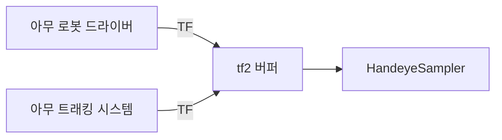
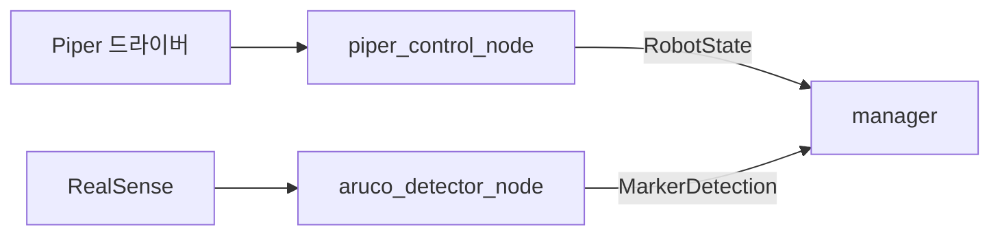

# autoCali vs easy_handeye2 비교

[easy_handeye2](https://github.com/marcoesposito1988/easy_handeye2)(marcoesposito1988)와
이 워크스페이스의 `autoCali`를 실제 소스를 읽고 비교한 문서입니다.

- 비교 기준: easy_handeye2 `master` (2026-07-26 clone), 총 약 1,670줄
- autoCali: 약 3,230줄 (노드 + 수학 코어 + 설정 + 테스트)
- 두 구현 모두 최종적으로 `cv2.calibrateHandEye()`를 호출합니다. **수학은 같고,
  다른 것은 "데이터를 어떻게 모으고 어떻게 믿을 것인가"입니다.**

---

## 0. 세 줄 요약

| | easy_handeye2 | autoCali |
|---|---|---|
| 정체성 | **범용 라이브러리** — 어떤 로봇/트래커에도 붙는 얇은 껍데기 | **전용 시스템** — Piper+RealSense에 최적화된 자동화 파이프라인 |
| 철학 | "TF만 있으면 된다. 품질 판단은 사람이" | "기계가 판단한다. 나쁜 샘플은 자동으로 버린다" |
| 강점 | 이식성, 표준성, eye-on-base 지원, 알고리즘 실시간 비교 | 자동화, 품질 게이팅, 정량 검증, 하드웨어 없는 테스트, 안전 |

**결론부터:** easy_handeye2의 방식이 "스탠다드"인 것은 맞지만, 그건 **인터페이스
설계**(TF 기반 추상화)에 한정된 이야기입니다. 데이터 품질 관리·검증·안전 측면은
autoCali가 확실히 앞섭니다. 이상적인 답은 **easy_handeye2의 TF 추상화를 흡수하고
autoCali의 품질 계층을 유지하는 것**입니다 (6절).

---

## 1. 가장 큰 차이: 데이터를 어디서 읽는가

이것이 **모든 다른 차이를 만들어내는 근본 분기점**입니다.

### easy_handeye2 — TF에서 읽는다

```python
# handeye_sampler.py:_get_transforms()
robot    = tfBuffer.lookup_transform(robot_base_frame, robot_effector_frame, time, Duration(seconds=1))
tracking = tfBuffer.lookup_transform(tracking_base_frame, tracking_marker_frame, time, Duration(seconds=1))
```

로봇이 Piper든 UR5든 Franka든, 트래커가 ArUco든 NDI든 OptiTrack이든
**상관하지 않습니다.** TF 트리에 4개 프레임만 있으면 동작합니다.



### autoCali — 전용 토픽에서 읽는다

```python
# handeye_calibration_node._get_synced_pair()
marker = self._latest_marker              # MarkerDetection (전용 msg)
best   = min(robots, key=lambda r: abs(r[0] - m_stamp))   # RobotState (전용 msg)
```



### 이 선택의 대가

| | easy_handeye2 (TF) | autoCali (전용 토픽) |
|---|---|---|
| 새 로봇 지원 | **코드 0줄** (TF만 있으면 됨) | 어댑터 노드 작성 필요 |
| 새 트래커 지원 | **코드 0줄** | 검출 노드 작성 필요 |
| 시간 동기화 | tf2가 보간으로 자동 처리 | 직접 구현 (`_get_synced_pair`) |
| 검출 품질 정보 | **없음** (TF는 자세만 나름) | 재투영오차·안정도·거절사유 전달 |
| 로봇 상태 정보 | **없음** (움직이는 중인지 모름) | `moving`/`enabled`/`connected` 전달 |
| 디버깅 | `tf2_echo` 하나로 끝 | 토픽 여러 개 확인 |

**핵심 트레이드오프:** TF는 아름답게 추상적이지만 **자세 외의 정보를 실어 나를 수
없습니다.** easy_handeye2가 품질 게이팅을 못 하는 근본 이유가 바로 이것입니다 —
TF만 봐서는 "이 검출이 믿을 만한가"를 알 방법이 없습니다.

---

## 2. 샘플 수집 정책 — 가장 실질적인 차이

### easy_handeye2: 게이트 없음

```python
def take_sample(self):
    sample = self._get_transforms()      # 그냥 현재 TF를 읽는다
    new_samples.append(sample)           # 그리고 넣는다. 끝.
```

- 로봇이 움직이는 중이어도 받습니다
- 마커가 흐릿해도 받습니다
- 직전 샘플과 자세가 똑같아도 받습니다
- 프레임 평균 없음 (단일 스냅샷)

품질 책임은 **전적으로 사람**에게 있습니다. 대신 `RemoveSample` 서비스로
GUI에서 눈으로 보고 지울 수 있습니다.

### autoCali: 5중 게이트 + N프레임 평균

| # | 게이트 | 기본값 |
|---|---|---|
| 1 | 로봇 정지 확인 | `moving == False` |
| 2 | 로봇-마커 시간차 | ≤ 0.2 s |
| 3 | 마커 안정도 | ≥ 0.6 |
| 4 | 확보 프레임 수 | ≥ obs/2 |
| 5 | 기존 샘플과 회전 차이 | ≥ 5° |

통과한 프레임 10장을 **쿼터니언 평균**(Markley)하여 샘플 1개를 만듭니다.

### 왜 이게 중요한가

게이트 5번(중복 자세 거절)은 특히 중요합니다. `A·X = X·B`에서 회전이 비슷한
샘플은 랭크를 늘리지 못해 **아무리 모아도 해가 좋아지지 않습니다.**
easy_handeye2는 이걸 막지 않으므로, 사용자가 비슷한 자세만 15번 찍으면
그럴듯한 쓰레기 결과가 나옵니다.

반대로 autoCali의 게이트는 **너무 엄격해서 샘플이 안 모이는** 실패 모드가
있습니다 (실제로 dry_run에서 이 문제 때문에 별도 감지 로직을 넣어야 했습니다).

---

## 3. 결과를 어떻게 믿는가 — 검증

### easy_handeye2: 정량 지표 없음

`handeye_server.py` 끝에 이렇게 적혀 있습니다:

```python
    # TODO: evaluation
```

`compute_calibration`은 `valid: true/false`만 돌려줍니다. 이 `valid`는
"샘플이 2개 이상이었나"일 뿐 정확도와 무관합니다. 별도 rqt **evaluator
플러그인**(233줄)이 있어 시각적으로 확인할 수는 있습니다.

### autoCali: 폐루프 RMS + 자동 이상치 제거

```
base_T_target_i = base_T_gripper_i @ gripper_T_camera @ camera_T_target_i
                  → 모든 i에 대해 같아야 함. 흩어진 정도 = 오차.
```

- 위치 RMS(m), 회전 RMS(°) — **물리적으로 해석 가능한 단위**
- 임계값으로 `SUCCESS` / `WARNING` / `FAILED` 자동 판정
- 잔차 최대 샘플을 하나씩 빼며 재계산 (최대 3회, 하한 보호)

이건 autoCali의 명확한 우위입니다. "1.97e-16 m"처럼 숫자로 확인할 수 있는 것과
"그림이 그럴듯해 보인다"는 전혀 다릅니다.

---

## 4. 로봇을 어떻게 움직이는가

### easy_handeye2: MoveIt 기반 — 다만 ROS 2에서 깨져 있음

`handeye_robot.py`는 MoveIt으로 현재 자세 주변에 자동으로 자세들을 생성하고,
**"미친 계획"(joint limit 초과)을 걸러내고**, 계획→사람 확인→실행 순서로
움직입니다. 설계는 훌륭합니다:

```python
target_poses = self._compute_poses_around_state(start_pose, angle_delta, translation_delta)
if CalibrationMovements._is_crazy_plan(plan, fallback_joint_limits):
    self.node.get_logger().err("Crazy plan found, not executing!")
```

**그러나 실제로는 ROS 2에서 동작하지 않습니다.** 확인한 사실:

```python
from moveit_commander import MoveGroupCommander   # handeye_robot.py:6
```

- `moveit_commander`는 **ROS 1 API**입니다. Humble에는 존재하지 않습니다
  (`ModuleNotFoundError` 확인함)
- `package.xml`의 의존성 목록에도 없습니다
- `handeye_server_robot.py`가 호출하는
  `HandeyeCalibrationParameters.read_from_parameter_server()`는 그 msg 타입에
  없는 메서드입니다
- `execute_plan()`은 `self.plan`을 읽는데 생성자는 `self.current_plan`을
  초기화합니다

즉 easy_handeye2의 **자동 이동 경로는 ROS 1에서 포팅되다 만 잔재**이고,
실사용 경로는 사실상 `freehand_robot_movement=true`(사람이 직접 움직임)입니다.
기본값도 `True`입니다.

### autoCali: 직접 Cartesian 명령 + 자체 안전 검증

MoveIt 없이 드라이버의 `/pos_cmd`(moveL)로 직접 보냅니다.

| | easy_handeye2 | autoCali |
|---|---|---|
| 충돌 회피 | MoveIt 플래너 (동작 시) | **없음** — 사용자가 자세를 검증해야 함 |
| 관절 한계 | `_is_crazy_plan` | 없음 (직교 공간만 검사) |
| 역기구학 | MoveIt | 드라이버에 위임 |
| 작업공간 제한 | 없음 | 박스 경계 + 스텝 거리 + 속도 상한 |
| 실행 전 확인 | 계획 보여주고 사람 승인 | `dry_run` 2중 잠금 |
| 실제 ROS 2 동작 | ✗ (MoveIt 경로 깨짐) | ✓ (검증됨) |

**정직한 평가:** autoCali는 충돌 회피가 없다는 게 진짜 약점입니다.
`calibration_poses.yaml`이 "자리표시자"라고 크게 경고하는 이유입니다.
반대로 easy_handeye2는 설계는 좋지만 그 코드가 ROS 2에서 돌지 않습니다.

---

## 5. 나머지 설계 차이

### 5.1 인터페이스 스타일

| | easy_handeye2 | autoCali |
|---|---|---|
| 방식 | **서비스 전용** (13개) + Empty 토픽 2개 | 액션 2개 + 서비스 9개 + 토픽 |
| 장시간 작업 | 없음 (각 호출이 즉시 반환) | 액션 (피드백/취소/진행률) |
| 외부 트리거 | `std_msgs/Empty` 토픽 → **로봇 티치펜던트 버튼 연결 가능** | 서비스 호출 |

easy_handeye2의 "샘플 찍기를 Empty 토픽으로도 받는다"는 작지만 영리한
아이디어입니다 — 로봇 물리 버튼에 바로 연결됩니다.

autoCali의 액션은 "15분짜리 자동 절차"에 맞는 올바른 선택입니다.
easy_handeye2에는 자동 절차라는 개념 자체가 (동작하는 형태로는) 없습니다.

### 5.2 알고리즘 선택

```python
# easy_handeye2: 런타임에 교체 가능
AVAILABLE_ALGORITHMS = {'Tsai-Lenz':…, 'Park':…, 'Horaud':…, 'Andreff':…, 'Daniilidis':…}
# ListAlgorithms / SetAlgorithm 서비스 → GUI 드롭다운에서 바꾸고 즉시 재계산
```

**같은 샘플로 5개 알고리즘을 돌려 결과가 일치하는지 보는 것**은 매우 강력한
교차검증입니다. autoCali는 goal에 method를 넣어 실행 시점에 정하므로,
비교하려면 캘리브레이션을 다시 돌려야 합니다 (샘플은 `_samples.yaml`에
저장되므로 오프라인 재계산은 가능).

`backend` 추상화도 easy_handeye2가 낫습니다 — OpenCV 외 다른 백엔드를
추가할 자리가 마련돼 있습니다.

### 5.3 캘리브레이션 관리

```python
# easy_handeye2
~/.ros2/easy_handeye2/calibrations/<name>.calib
~/.ros2/easy_handeye2/samples/<name>.samples
```

`name` 파라미터로 **여러 캘리브레이션이 공존**합니다. 로봇이 여러 대거나
카메라를 바꿔가며 쓸 때 자연스럽습니다.

```python
# autoCali
~/.ros/piper_auto_handeye/handeye_<method>_<timestamp>.yaml
```

타임스탬프 기반이라 이력은 남지만 **"이건 무슨 설정의 결과인가"를 이름으로
알 수 없습니다.** 대신 파일 안에 `source`/`validation` 메타데이터가 훨씬
풍부합니다.

### 5.4 eye-in-hand vs eye-on-base

easy_handeye2는 **한 줄로 둘 다** 지원합니다:

```python
if calibration_type == 'eye_in_hand':
    robot = lookup(robot_base_frame, robot_effector_frame)
else:                                  # eye_on_base
    robot = lookup(robot_effector_frame, robot_base_frame)   # 방향만 뒤집음
```

(소스 주석: *"here we trick the library... Trust me, I'm an engineer"*)

autoCali는 **eye-in-hand 전용**입니다. 카메라를 삼각대에 올리는 구성이
필요해지면 지금은 못 씁니다.

### 5.5 수학 라이브러리

| | easy_handeye2 | autoCali |
|---|---|---|
| 라이브러리 | `transforms3d` (외부 의존) | 순수 numpy (자체 구현 276줄) |
| 쿼터니언 순서 | `(w,x,y,z)` — transforms3d 관례 | `(x,y,z,w)` — ROS 관례, 경계에서만 변환 |
| 단위 테스트 | **없음** | 17개 (합성 복원·노이즈·가드·필터) |
| 자세 평균 | 없음 (단일 샘플) | Markley 쿼터니언 평균 |

autoCali가 바퀴를 다시 발명한 것은 맞지만, 그 대가로 **ROS 없이 테스트 가능한
수학 코어**를 얻었습니다. 이건 hand-eye처럼 부호 하나로 조용히 틀리는
분야에서 큰 가치가 있습니다.

### 5.6 하드웨어 없는 테스트

| | easy_handeye2 | autoCali |
|---|---|---|
| 목 로봇 | 없음 | `mock_robot_node` (속도 제한 보간) |
| 목 카메라 | 없음 | `synthetic_marker_publisher_node` (정답 역산) |
| 검증 방법 | 없음 | **알려진 값 복원 확인** |

launch에 더미 static TF를 넣어두긴 하지만(`node_dummy_calib_eih`), 이건
TF 트리를 연결해주는 자리표시자일 뿐 파이프라인 검증 장치가 아닙니다.

autoCali는 `gripper_T_camera = [0.05,-0.03,0.08], rpy=[0.1,0.2,0.05]`를
심어두고 파이프라인이 이를 **기계 정밀도로 복원**하는지 확인합니다.
변환 방향·부호·순서가 전부 맞아야만 통과하는 강력한 테스트입니다.

---

## 6. 그래서 무엇을 가져올 것인가

우선순위 순으로, 각각의 실제 이득과 비용입니다.

### ★★★ 1. TF 기반 샘플링을 **추가 옵션**으로

지금 구조를 버리라는 게 아니라, `_get_synced_pair()` 옆에 TF 경로를 하나 더
두는 것입니다:

```python
# handeye_calibration_node.py 에 파라미터 추가
sample_source: "topics" | "tf"    # 기본값 topics (현행 유지)
```

- **이득:** 로봇을 바꾸거나(UR, Franka) 트래커를 바꿔도(ChArUco, OptiTrack,
  이미 워크스페이스에 있는 `aruco_detector`) 코드 수정 없이 동작
- **비용:** 품질 게이트 1·3번(로봇 정지·마커 안정도)을 TF 모드에서는 쓸 수
  없음 → 그 모드에서만 완화
- **난이도:** 낮음. `tf2_ros.Buffer.lookup_transform` 두 번이면 됨

### ★★★ 2. eye-on-base 지원

easy_handeye2의 "방향만 뒤집기" 트릭이면 됩니다. 수학 코어는 이미 대칭적이라
`calibration_type` 파라미터 하나와 lookup 방향 분기, TF 발행 시 부모 프레임
분기만 추가하면 됩니다.

- **이득:** 카메라를 삼각대/천장에 두는 구성 지원
- **난이도:** 낮음

### ★★ 3. 이름 있는 캘리브레이션

`name` 파라미터를 추가해 `~/.ros/piper_auto_handeye/<name>.yaml`로 저장.
타임스탬프는 이력용으로 유지.

### ★★ 4. 오프라인 재계산 도구

이미 `_samples.yaml`에 원본 샘플을 저장하고 있습니다. 이걸 읽어
**5개 알고리즘으로 전부 돌려 RMS를 비교하는 스크립트**를 만들면
easy_handeye2의 알고리즘 교차검증 이득을 로봇 없이 얻습니다.
autoCali의 검증기가 있으니 easy_handeye2보다 오히려 낫습니다.

```bash
# 예: ros2 run piper_auto_handeye recompute_calibration --samples ..._samples.yaml --all-methods
```

### ★★ 5. 샘플 개별 삭제 (`RemoveSample`)

지금은 `reset_calibration`으로 전부 지우는 것만 됩니다. GUI에서 샘플 목록을
보고 하나만 빼는 기능이 있으면 수동 모드가 훨씬 쓸 만해집니다.

### ★ 6. `std_msgs/Empty` 트리거 토픽

`add_manual_sample`을 서비스뿐 아니라 Empty 토픽으로도 받으면, 티치펜던트
버튼이나 풋스위치에 바로 연결할 수 있습니다. 구현 3줄.

---

## 7. 반대로 easy_handeye2가 가져가야 할 것

공정하게 말하면, 이쪽이 명백히 앞서는 부분들입니다:

1. **폐루프 RMS 검증** — easy_handeye2의 `# TODO: evaluation`을 채우는 것
2. **품질 게이팅** — 최소한 "로봇이 움직이는 중이면 샘플 거부"
3. **중복 자세 거절** — 랭크를 못 늘리는 샘플을 막는 것
4. **N프레임 평균** — 단일 스냅샷은 노이즈에 취약
5. **`MIN_SAMPLES = 2`** — 소스 주석도 *"correct? ... sounds strange"*라고
   자문합니다. 실무 권장은 15~25개입니다
6. **하드웨어 없는 정답 복원 테스트**

---

## 8. 최종 정리

```
                품질/검증/안전
                     ▲
                     │
        autoCali  ●  │
                     │
                     │        ● 이상적 목표
                     │          (TF 추상화 + 품질 계층)
                     │
                     │  ● easy_handeye2
                     └──────────────────────► 범용성/이식성
```

- **"스탠다드"라는 인상의 정체**는 easy_handeye2의 **TF 기반 추상화**입니다.
  이건 실제로 배울 가치가 있고, 위 6-1·6-2로 흡수 가능합니다.
- 다만 easy_handeye2는 **얇습니다.** 품질 판단·정량 검증·안전을 전부 사람에게
  맡기고, 자동 이동 코드는 ROS 2에서 동작하지 않습니다.
- autoCali는 **두껍고 특정 하드웨어에 묶여 있지만**, 데이터 품질과 검증과
  안전에서 훨씬 진지합니다. 그리고 실제로 ROS 2 Humble에서 동작합니다
  (검증 완료).
- 지금 프로젝트의 목표가 "Piper로 신뢰할 수 있는 캘리브레이션을 반복 수행"이라면
  **현재 구조가 더 적합합니다.** easy_handeye2에서는 인터페이스 설계만
  가져오는 것이 최선입니다.

관련 문서: [ARCHITECTURE.ko.md](ARCHITECTURE.ko.md), [README.ko.md](README.ko.md)
